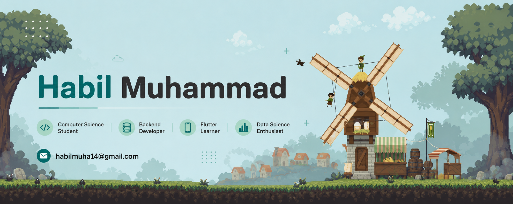

# Hi, I'm Habil 👋

Informatics Engineering student exploring everything from databases to networking, web development to machine learning.

  
  
  
  

## 🎓 About Me

- 📚 Informatics Engineering student at Universitas Hang Tuah Pekanbaru
- 💻 Current coursework: Information Systems Design, Computer Networks, Databases, Data Mining, Cryptography
- 🌱 Currently learning: Flutter, Machine Learning, advanced Laravel
- 🔭 I prefer learning through practical examples with real data over pure theory

## 🛠️ Tech Stack

**Web & Backend**

**Database**

**Data Science**

**Other**

## 📂 Some Projects

- **Task Manager** — Laravel-based task management app with role-based access control
- **Library Management System** — Book lending system built with Laravel
- **Simple Online Store** *(in progress)* — A simple Laravel-based online store
- **Network Practicals** — VLAN, Inter-VLAN Routing, DHCP, and ACL configuration for a Smart Hotel topology

## 🔥 GitHub Streak

  

## 📫 Contact

- 📧 Email: habilmuha14@gmail.com

---
